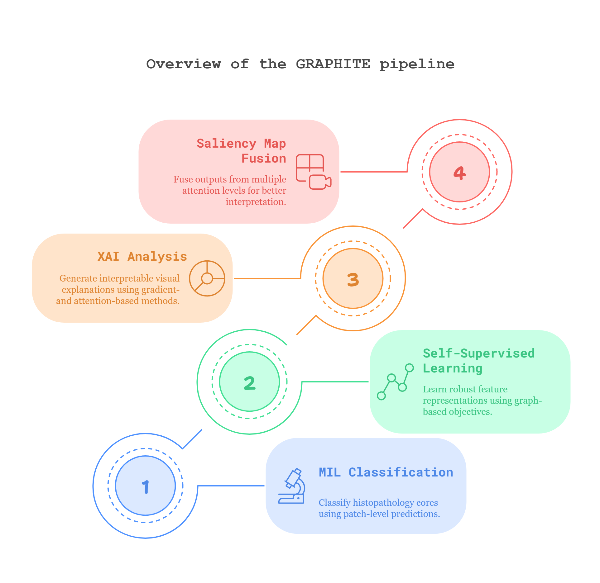

# GRAPHITE: Graph-Based Interpretable Tissue Examination for Enhanced Explainability in Breast Cancer Histopathology

[](https://www.python.org/downloads/)
[](https://pytorch.org/)
[](https://opensource.org/licenses/MIT)
[](https://xai.readthedocs.io/en/latest/)
[](https://xai.readthedocs.io/en/latest/?badge=latest)

## 📄 About

GRAPHITE is a state-of-the-art deep learning framework specifically designed for breast cancer histopathology analysis. Our approach combines graph-based representations with interpretable AI techniques to provide clinically relevant insights for pathologists. The framework leverages hierarchical graph attention networks and multiple instance learning to analyze tissue microenvironments while maintaining full explainability of predictions through advanced visualization techniques.

**🔗 Explore GRAPHITE:**
- **🌐 [Paper Website](https://beamish-tartufo-7df496.netlify.app/)** - Official project website
- **📖 [Interactive Code Documentation](https://deepwiki.com/raktim-mondol/GRAPHITE)** with [step-by-step tutorial](https://code2tutorial.com/tutorial/6f28591e-564f-4ea8-9c7b-e6df90011d14/index.md) for complete GRAPHITE implementation guide
- **📊 [Analytical Report](https://www.perplexity.ai/page/explainable-ai-in-histopatholo-K9_5b__ZToK5XXM5T67OvA)** - Explore our comprehensive analytical findings
- **📖 [Complete Documentation](https://xai-graphite.readthedocs.io/)** - Comprehensive documentation on Read the Docs

**Key Innovation**: GRAPHITE introduces a novel multi-scale graph representation that captures both local cellular interactions and global tissue architecture, enabling more accurate and interpretable breast cancer diagnosis from histopathology images.

A comprehensive deep learning pipeline for histopathology image analysis that combines **Multiple Instance Learning (MIL)**, **hierarchical Graph Attention Networks (HierGAT)**, and **explainable AI (XAI)** techniques for enhanced breast cancer diagnosis and visualization.

## 🌟 Overview

GRAPHITE provides an end-to-end solution for analyzing histopathology images through a carefully designed 4-step pipeline:

1. **MIL Classification** - Train attention-based models on patch-level data
2. **Self-Supervised Learning** - Learn hierarchical representations using Graph Neural Networks  
3. **XAI Visualization** - Generate explainable attention maps and feature visualizations
4. **Saliency Map Fusion** - Combine different attention mechanisms for enhanced interpretability

## 🏗️ Pipeline Architecture



## 📋 Table of Contents

- [Features](#-features)
- [Installation](#-installation)
- [Quick Start](#-quick-start)
- [Data Structure](#-data-structure)
- [Usage](#-usage)
- [Pipeline Steps](#-pipeline-steps)
- [Results](#-results)
- [Troubleshooting](#-troubleshooting)
- [Contributing](#-contributing)
- [Citation](#-citation)

## ✨ Features

### 🔬 **Advanced Deep Learning Models**
- **Attention-based MIL**: State-of-the-art multiple instance learning with attention mechanisms
- **HierGAT**: Hierarchical Graph Attention Networks for spatial relationship modeling
- **ResNet Backbone**: Pre-trained ResNet models optimized for histopathology
- **Self-Supervised Learning**: Learn rich representations without manual annotations

### 🎯 **Explainable AI Integration**
- **Attention Visualization**: Generate high-quality attention heatmaps
- **Feature Analysis**: Comprehensive feature importance analysis
- **Interactive Visualizations**: Web-based interactive exploration tools
- **Multi-scale Analysis**: Patch, region, and slide-level explanations

### 🔄 **Robust Training Pipeline**
- **Reproducible Results**: Fixed random seeds and deterministic training
- **Early Stopping**: Intelligent training termination to prevent overfitting
- **Learning Rate Scheduling**: Adaptive learning rate adjustments
- **Comprehensive Logging**: Detailed training progress and metrics tracking

### 📊 **Comprehensive Evaluation**
- **Multiple Metrics**: Accuracy, F1-score, AUC, and custom metrics
- **Cross-validation**: Robust performance estimation
- **Statistical Analysis**: Confidence intervals and significance testing
- **Visualization Tools**: Training curves, confusion matrices, and ROC curves

## 🔧 System Requirements

- **GPU**: NVIDIA Tesla V100 32GB (used/recommended)
- **RAM**: 32GB+ system memory 
- **Storage**: 50GB+ free space
- **OS**: Linux or Windows with WSL2/Docker
- **Python**: 3.9.2 or higher with PyTorch 2.0.0 and CUDA 11.7

## 🚀 Quick Installation

```bash
# Clone repository
git clone https://github.com/raktim-mondol/GRAPHITE.git
cd GRAPHITE

# Automated setup (recommended)
./quickstart.sh

# Or Docker setup
docker-compose up --build
```

**💡 For detailed installation instructions, platform-specific setup, and troubleshooting:** [SETUP.md](SETUP.md)

## ⚡ Quick Start

### 1. **Setup & Data Preparation**
```bash
# Automated setup
./quickstart.sh

# Organize data (see DATA_STRUCTURE.md for details)
dataset/
├── training_dataset_step_1/tma_core/
│   ├── 10025/ (cancer), 20001/ (normal), ...
├── training_dataset_step_2/core_image/
└── visualization_dataset/{core_image,mask}/
```

### 2. **Run Pipeline**
```bash
# Complete pipeline
./quickstart.sh

# Or step by step
python training_step_1/run_training.py --epochs 50
python training_step_2/self_supervised_training/train.py --epochs 100
python visualization_step_1/xai_visualization/main.py
python visualization_step_2/fusion_visualization/main_final_fusion.py
```

**📋 For complete data organization guide:** [DATA_STRUCTURE.md](DATA_STRUCTURE.md)  
**🔄 For exact reproducibility steps:** [REPRODUCIBILITY.md](REPRODUCIBILITY.md)

## 📖 Usage

### Basic Commands
```bash
# Complete pipeline execution
./quickstart.sh

# Individual training steps
python training_step_1/run_training.py --epochs 50
python training_step_2/self_supervised_training/train.py --epochs 100
python visualization_step_1/xai_visualization/main.py --method gradcam
python visualization_step_2/fusion_visualization/main_final_fusion.py
```

**💡 For detailed usage instructions and parameters, see individual component README files:**
- **[Training Step 1](training_step_1/USAGE.md)** - MIL classification parameters and options
- **[Training Step 2](training_step_2/self_supervised_training/README.md)** - HierGAT training configuration
- **[Visualization Step 1](visualization_step_1/xai_visualization/README.md)** - XAI methods and parameters  
- **[Visualization Step 2](visualization_step_2/fusion_visualization/README_main_final_fusion.md)** - Attention fusion approaches

## 🔬 Pipeline Steps

### Step 1: Multiple Instance Learning (MIL)
- **Input**: Patient folders with histopathology patches
- **Model**: Attention-based MIL with ResNet backbone
- **Output**: Patient-level cancer classification
- **Key Features**: 
  - Patch-level attention weights
  - Color normalization support
  - Balanced sampling options

### Step 2: Self-Supervised Learning
- **Input**: Core tissue images (no annotations needed)
- **Model**: Hierarchical Graph Attention Network (HierGAT)
- **Output**: Rich feature representations
- **Key Features**: 
  - Graph-based spatial modeling
  - Hierarchical attention mechanisms
  - Unsupervised representation learning

### Step 3: XAI Visualization  
- **Input**: Trained MIL model + visualization dataset
- **Methods**: Attention maps, GradCAM, LIME, integrated gradients
- **Output**: Explainable visualizations and feature importance
- **Key Features**: 
  - Multiple XAI techniques
  - Interactive visualization tools
  - Quantitative explainability metrics

### Step 4: Saliency Map Fusion
- **Input**: MIL and SSL models + visualization data
- **Process**: Attention fusion and multi-scale analysis
- **Output**: Enhanced interpretability and diagnostic insights
- **Key Features**: 
  - Cross-modal attention fusion
  - Multi-scale feature analysis
  - Comprehensive diagnostic reports

## 📊 Results

### Expected Performance Benchmarks

**MIL Classification (Step 1):**
- Accuracy: 85-92%
- AUC: 0.90-0.95
- F1-Score: 0.82-0.89
- Training Time: 2-4 hours (GPU)

**Self-Supervised Learning (Step 2):**
- Convergence: 50-100 epochs
- Feature Quality: High-dimensional representations
- Training Time: 4-8 hours (GPU)

**Visualization Quality (Steps 3-4):**
- Attention Map Resolution: High-quality heatmaps
- Explainability Metrics: ROAR, KAR scores
- Processing Time: 10-30 minutes per dataset

### Output Files Structure
```
outputs/
├── training_step_1/
│   ├── best_model.pth
│   ├── training_history.png
│   └── metrics.json
├── training_step_2/
│   ├── ssl_model.pth
│   ├── embeddings.npy
│   └── training_logs.txt
├── visualization_step_1/
│   ├── attention_maps/
│   ├── gradcam_visualizations/
│   └── analysis_report.html
└── visualization_step_2/
    ├── fusion_maps/
    ├── multi_scale_analysis/
    └── final_report.pdf
```

## 🔧 Troubleshooting

### Common Issues and Solutions

#### **GPU Memory Issues**
```bash
# Reduce batch size
python train.py --batch_size 4

# Use gradient accumulation
python train.py --accumulate_grad_batches 4
```

#### **CUDA Compatibility**
```bash
# Check CUDA version
nvidia-smi

# Install compatible PyTorch
pip install torch==2.0.0+cu117 torchvision==0.15.0+cu117 -f https://download.pytorch.org/whl/torch_stable.html
```

#### **Data Loading Errors**
```bash
# Validate data structure
python -c "from src.utils.data_validation import validate_dataset; validate_dataset('dataset/')"

# Check file permissions
chmod -R 755 dataset/
```

#### **Memory Optimization**
- Reduce `max_patches` parameter for MIL training
- Use `--num_workers 0` if experiencing multiprocessing issues
- Enable `--pin_memory False` for systems with limited RAM

#### **Performance Issues**
- Ensure CUDA is properly installed and detected
- Use SSD storage for faster data loading
- Monitor GPU utilization with `nvidia-smi`
- Consider mixed precision training for larger models

### Getting Help

1. **Check Logs**: Review training logs in `output/` directories
2. **Validate Data**: Use provided validation scripts
3. **System Check**: Run `quickstart.sh` option 10 for system diagnostics
4. **Documentation**: Refer to detailed guides in `docs/`
5. **Issues**: Create a GitHub issue with error logs and system info

## 📚 Additional Documentation

- **[SETUP.md](SETUP.md)** - Detailed installation instructions
- **[DATA_STRUCTURE.md](DATA_STRUCTURE.md)** - Comprehensive data organization guide
- **[REPRODUCIBILITY.md](REPRODUCIBILITY.md)** - Steps to reproduce results

## 🤝 Contributing

We welcome contributions! Please see our contributing guidelines:

1. Fork the repository
2. Create a feature branch (`git checkout -b feature/amazing-feature`)
3. Commit your changes (`git commit -m 'Add amazing feature'`)
4. Push to the branch (`git push origin feature/amazing-feature`)
5. Open a Pull Request

## 📄 License

This project is licensed under the MIT License - see the [LICENSE](LICENSE) file for details.

## 🙏 Acknowledgments

- **TIA Toolbox** for histopathology image processing tools
- **PyTorch Geometric** for graph neural network implementations  
- **Grad-CAM** for explainable AI visualization techniques
- **SHAP** for interpretable machine learning
- **Medical imaging community** for datasets and evaluation benchmarks

## 📞 Contact

For questions and support:
- **Create an issue** on GitHub for bug reports and feature requests
- **Check documentation** in the `docs/` directory for detailed guides
- **Review examples** in the `examples/` directory for usage patterns

---

## 📈 Citation

If you use GRAPHITE in your research, please cite:

```bibtex
@misc{mondol2025graphitegraphbasedinterpretabletissue,
      title={GRAPHITE: Graph-Based Interpretable Tissue Examination for Enhanced Explainability in Breast Cancer Histopathology}, 
      author={Raktim Kumar Mondol and Ewan K. A. Millar and Peter H. Graham and Lois Browne and Arcot Sowmya and Erik Meijering},
      year={2025},
      eprint={2501.04206},
      archivePrefix={arXiv},
      primaryClass={eess.IV},
      url={https://arxiv.org/abs/2501.04206}, 
}
```

---

**⭐ Star this repository if you find it helpful!** 